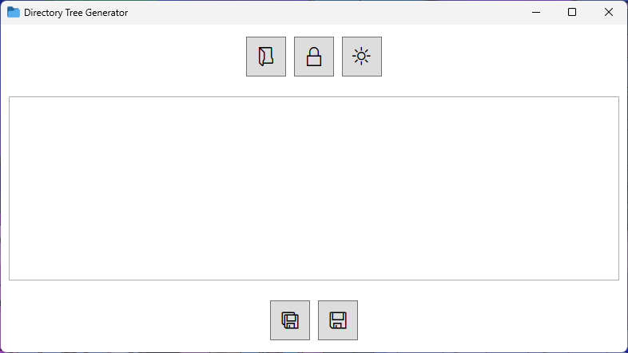
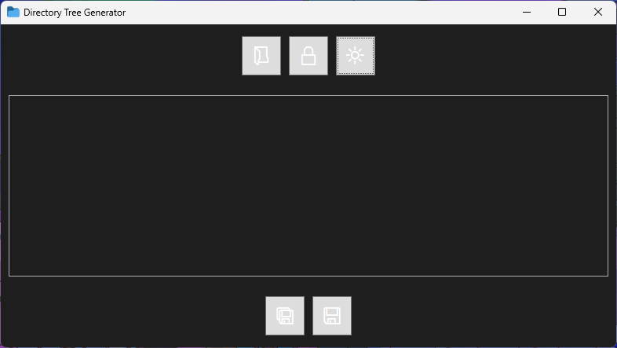

# Directory Tree Generator

A user-friendly Windows application to generate and visualize the directory structure of any folder. Whether you're a developer, system administrator, or just organizing your files, this tool simplifies the process of mapping out directory trees.


## Table of Contents

- [Features](#features)
- [Screenshots](#screenshots)
- [Download and Installation](#download-and-installation)
- [Usage](#usage)
- [Contributing](#contributing)
- [Issues](#issues)
- [License](#license)
- [Acknowledgments](#acknowledgments)
- [Contact](#contact)

## Features

- 📂 **Visual Directory Structure**: Generate a clear, formatted tree view of directories.
- 👁️ **Include/Exclude Hidden Items**: Toggle the inclusion of hidden files and folders.
- 🌗 **Theme Toggle**: Switch between light and dark themes for comfortable viewing.
- 🖱️ **Drag and Drop Support**: Quickly generate a tree by dragging and dropping a folder into the application.
- 📋 **Copy to Clipboard**: Copy the generated directory tree to the clipboard effortlessly.
- 💾 **Save to File**: Save the output as a text file for documentation or sharing.

## Screenshots


### Light Theme



### Dark Theme




## Download and Installation

Download the latest version from the [Releases](https://github.com/yourusername/DirectoryTreeGenerator/releases) page.

### Installation Steps

1. **Download the Installer**: Navigate to the [Releases](https://github.com/yourusername/DirectoryTreeGenerator/releases) page and download the `DirectoryTreeGenerator.msi` file.
2. **Run the Installer**: Double-click the MSI file and follow the installation wizard.
3. **Complete Installation**: After installation, the application will be available in your Start Menu or installation directory.

## Usage

1. **Launch the Application**: Open the Directory Tree Generator from your Start Menu.
2. **Select a Folder**:
   - Click the **folder icon** button to open the folder selection dialog.
   - Alternatively, **drag and drop** a folder directly into the application window.
3. **Generate the Tree**: The directory tree will be displayed in the output area.
4. **Include/Exclude Hidden Items**: Click the **eye icon** button to toggle hidden files and folders.
5. **Switch Theme**: Click the **theme icon** (sun/moon) to switch between light and dark themes.
6. **Copy or Save**:
   - Click the **copy icon** button to copy the directory tree to the clipboard.
   - Click the **save icon** button to save the output to a text file.

## Contributing

We welcome contributions! To contribute:

1. **Fork the Repository**: Use the "Fork" button to create your own copy.
2. **Clone Your Fork**:
   ```bash
   git clone https://github.com/yourusername/DirectoryTreeGenerator.git
